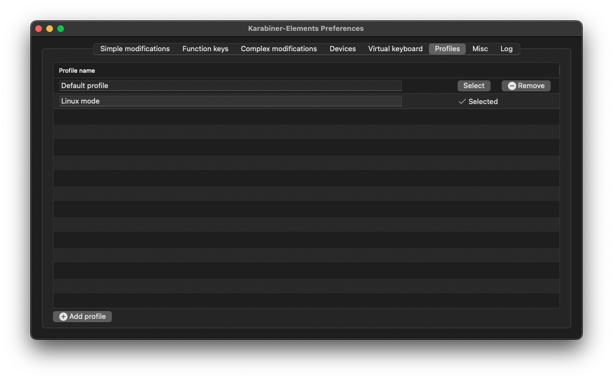
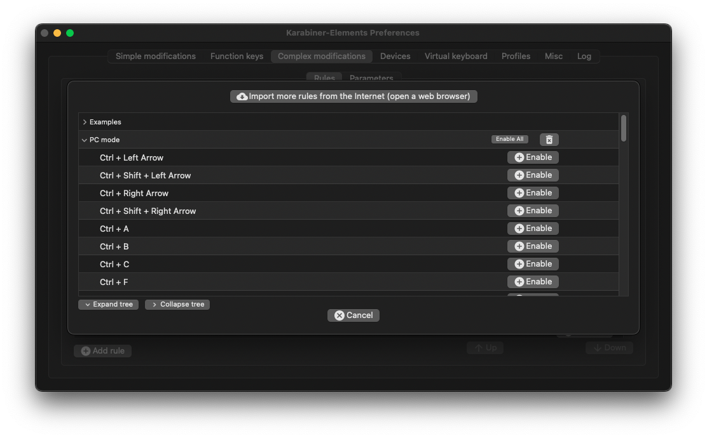

# macOS Linux mode

All-in-one project to help you get PC-like experience on your maOS. Mostly for developers & other IT guys, but not only
😉.

What you can get:

- PC keyboard shortcuts on your macOS, browser (chromium based) and IntelliJ
    - the configuration works for both PC and Mac keyboards in same time (there is a special device-checking rule)
    - there are no custom shortcuts - all of them would do exactly the same on Linux/Windows or almost (e.g. <kbd>
      Win</kbd>/<kbd>Option</kbd> key opens Spotlight while on Windows or Linux Mint would open Start Menu)
- Dock & built-in switcher replacement
- basic window management

The toolset (all open source):

- [karabiner-elements](https://karabiner-elements.pqrs.org/) - keys remapping tool
- [AltTab](https://alt-tab-macos.netlify.app/) - replacement for both Dock & Switcher
- [Rectangle](https://rectangleapp.com/) - simple window manager
- [iTerm2](https://iterm2.com/) - widely used macOS terminal replacement, however not crucial for the setup

## Shortcuts

### Importing karabiner-elements rules

1. Install [karabiner-elements](https://karabiner-elements.pqrs.org/)
2. Open karabiner-elements, create new profile (e.g. _Linux mode_) and select it:


3. Open the following URL in your browser and allow the website to open Karabiner-Elements.app:

     ```
     karabiner://karabiner/assets/complex_modifications/import?url=https://raw.githubusercontent.com/raxigan/macos-linux-mode/init/linux-mode.json
     ```

4. Click _Import_:


5. Click _Enable All_:


### Importing IntelliJ IDEA keymap

Importing karabiner-elements beforehand is required.
1. Install IntelliJ plugin [XWin Keymap](https://plugins.jetbrains.com/plugin/13094-xwin-keymap) (it used to be preinstalled)
2. Copy [XWin IntelliJ.xml](https://github.com/raxigan/macos-linux-mode/blob/init/XWin%20IntelliJ.xml) file into the keymap configuration directory: `~/Library/Application Support/JetBrains/IntelliJIdea2021.3/keymaps` (the path may differ)
3. Restart IntelliJ IDEA and go to Preferences → Keymap and in the dropdown select *XWin IntelliJ* keymap.

### Fixing <kbd>Home</kbd> & <kbd>End</kbd> keys

By default, macOS does not bind <kbd>Home</kbd> & <kbd>End</kbd> keys to any function. 
To make them to, respectively, move caret to beginning and end of line run the following command within
this project root directory (clone it first): 
```
mkdir -p ~/Library/KeyBindings && cp DefaultKeyBinding.dict ~/Library/KeyBindings
```

Then restart your Mac.
