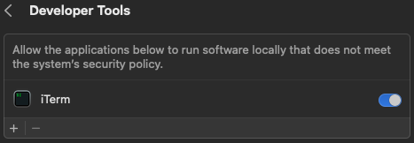

# PC'fy my mac

<p>
<a href="https://github.com/raxigan/pcfy-my-mac/actions">
    
</a>
<a href="https://github.com/raxigan/pcfy-my-mac/releases">
    
</a>
</p>

All-in-one project to help you to get PC-like experience (known from Windows or Linux systems) on your macOS.

---

This is a set of configuration files for applications
like [Karabiner-Elements](https://karabiner-elements.pqrs.org/), [AltTab](https://alt-tab-macos.netlify.app/)
and [Rectangle](https://rectangleapp.com/)
wrapped into an easy-to-use CLI tool that automates the whole setup process. It’s an ideal solution for those new to
macOS or for users who frequently switch between macOS and Windows or Linux.
You can think of this project as [Kinto](https://github.com/rbreaves/kinto), but in reverse.

## Features

- **Keyboard shortcuts:** for system, Finder and browser (Chromium-based) actions
- **JetBrains tools keymaps:** Keymaps for JetBrains tools
- **Quick application launching:** Launch applications quickly using a single Win/Opt key
- **Window Snapping:** Easily snap windows using Win/Opt + ←/→ keys
- **Better window switcher**: Move between windows with Alt+Tab shortcut
- **Everything works on any keyboard layout (you can use built-in mac and external PC keyboard in same time)**


## Installation

### [Homebrew](https://brew.sh/)

```shell
brew install raxigan/tap/pcfy-my-mac
```

### Script

Requires [special terminal permissions](#Terminal-dev-permissions)

```shell
/bin/bash -c "$(curl -fsSL https://raw.githubusercontent.com/raxigan/pcfy-my-mac/main/pcfy.sh)"
```

### Go binary

```shell
go install github.com/raxigan/pcfy-my-mac@latest
```

### From sources

```shell
go run pcfy.go
```

## Shortcuts list

List of shortcuts available immediately after installation.

<details>
  <summary>Click to expand</summary>

  ```txt
  Win + Left/Right            # Snap window to left/right
  Win + Up/Down               # Maximixe/almost maximize window
  Ctrl + Left/Right           # Move to previous/next word
  Ctrl + Shift + Left/Right   # Select previous/next word
  Home/End                    # Move to beginning/end of line
  Ctrl + Home/End             # Move to beginning/end of document
  Shift + Home/End            # Move to beginning/end of line with selection
  Ctrl + Shift + Home/End     # Move to beginning/end of document with selection
  Ctrl + A                    # Select all
  Ctrl + B                    # Bold
  Ctrl + C                    # Copy item, interrupt current process in terminal
  Ctrl + F                    # Find
  Ctrl + I                    # Italic
  Ctrl + N                    # New...
  Ctrl + L                    # Open location in browser
  Ctrl + O                    # Open...
  Ctrl + R                    # Replace/Reload
  Ctrl + S                    # Save
  Ctrl + T                    # New browser/terminal tab
  Ctrl + Shift + T            # Reopen last closed browser/terminal tab
  Ctrl + U                    # Underline
  Ctrl + V                    # Paste item
  Ctrl + W                    # Close browser tab
  Ctrl + X                    # Cut
  Ctrl + Y                    # Redo
  Ctrl + Z                    # Undo
  Ctrl + Tab                  # Move to next browser/terminal tab
  Ctrl + Shift + Tab          # Move to previous browser/terminal tab
  Ctrl + Shift + Z            # Redo
  Win + L                     # Lock screen
  F2                          # Rename file in Finder
  F3/Shift + F3               # Move to next/previous ocurrence in text
  F5                          # Reload page in browser
  Win                         # Open preferred application launcher
  Ctrl + Alt + T              # Open preferred terminal
  ```

</details>

### Terminal dev permissions

**Necessary only if you install it by shell script**. The binary is not signed, so macOS won't let you run it without
the following permissions
for your terminal. Just go to *System Settings* > *Privacy & Security* > *Developer Tools* and enable it:



## Troubleshooting

TBD

## Missing things:

- Finder and Fleet keymaps are incomplete
- Select files using Opt+LMB instead of Ctrl like you would on PC
- Multicursor shortcut (2xCtrl in Jetbrains tools on PC) is under 2xCmd
- There's no Alt/Cmd+F4, use Win/Opt+Q instead - it's easy to add (I'm kind of used to it though)

## Acknowledgments

- [@tezeko](https://github.com/tekezo) for [Karabiner-Elements](https://karabiner-elements.pqrs.org/)
- [@lwouis](https://github.com/lwouis) for [AltTab](https://alt-tab-macos.netlify.app/)
- [@rxhanson](https://github.com/rxhanson) for [Rectangle](https://rectangleapp.com/)
- [@rux616](https://github.com/rux616) for [karabiner-windows-mode](https://github.com/rux616/karabiner-windows-mode)
- [@serhii-londar](https://github.com/serhii-londar)
  for [open-source-mac-os-apps](https://github.com/serhii-londar/open-source-mac-os-apps)