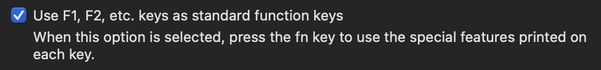
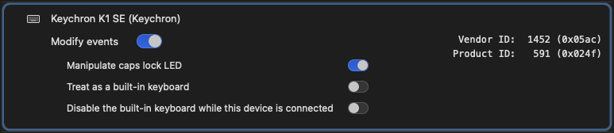

<div align="center">
  <div align="center" style="width: 50%; padding: 5px; margin: auto;">

# PC'fy my Mac

  <p>
  <a href="https://github.com/raxigan/pcfy-my-mac/actions"></a>
  <a href="https://github.com/raxigan/pcfy-my-mac/releases"></a>
  </p>

All-in-one project to help you get a **PC**-like experience (known from **Windows** or **Linux** systems) on your *
*macOS**.

  </div>
</div>

---

This is a set of configuration files for open source applications
like [Karabiner-Elements](https://karabiner-elements.pqrs.org/), [AltTab](https://alt-tab-macos.netlify.app/)
and [Rectangle](https://rectangleapp.com/)
wrapped into an easy-to-use CLI tool that automates the whole setup process. It’s an ideal solution for
those who are new to macOS and for users who frequently switch between macOS and Windows or Linux.
This is also perfect for you if the macOS out-of-the-box workspace management isn’t really your thing.

You can think of this project as [Kinto](https://github.com/rbreaves/kinto), but in reverse and with more features.

## Features

- **Keyboard shortcuts:** keyboard shortcuts mappings for system, Finder and browser (Chromium-based) actions
- **JetBrains tools keymaps:** battle-tested keymaps for JetBrains tools
- **Quick application launching:** launch (or switch) applications quickly with just the Win/Opt key
- **Window snapping:** snap windows using Win/Opt + ←/→ keys
- **Better window switcher**: move between windows with Alt + Tab shortcut
- **Everything works on any keyboard layout (you can use both the built-in Mac and external PC keyboards at the same
  time)**


## Installation

### [Homebrew](https://brew.sh/)

```shell
brew install raxigan/tap/pcfy-my-mac
pcfy-my-mac
```

### Script

May require [special terminal permissions](#Terminal-dev-permissions)

```shell
/bin/bash -c "$(curl -fsSL https://raw.githubusercontent.com/raxigan/pcfy-my-mac/main/pcfy.sh)"
```

### Go binary

```shell
go install github.com/raxigan/pcfy-my-mac@latest
pcfy-my-mac
```

### From source

```shell
git clone https://github.com/raxigan/pcfy-my-mac
cd pcfy-my-mac
go run pcfy.go
```

## Options

| Flag                      | Description                                                                                                                                        |
|---------------------------|----------------------------------------------------------------------------------------------------------------------------------------------------|
| **--help**                | Show usage                                                                                                                                         |
| **--params** <params.yml> | Path to your YAML file containing installation parameters. Allows to run the tool in non-interactive mode. Use below option to see the file format |
| **--show-sample-yaml**    | Show sample yaml config which can be used as the input for above flag                                                                              |
| **--verbose**             | Enable verbose mode. All performed operations will be logged out to console                                                                        |
| **--version**             | Show version information                                                                                                                           |

## Shortcut list

The following shortcuts are available right after installation. Note that shortcuts from the tools' keymaps are not
listed here.

For Mac keyboard layout:

- The **Win** key corresponds to **Opt**
- The **Alt** key corresponds to **Cmd**

<details>
  <summary><b>Shortcut list - click to expand</b></summary>

  ```txt
  Alt + Tab                   # Switch to next window
  Alt + Shift                 # Switch to previous window (only when switcher is opened)
  Win + Left/Right            # Snap window to left/right
  Win + Up/Down               # Maximixe/almost maximize window
  Ctrl + Left/Right           # Move to previous/next word
  Ctrl + Shift + Left/Right   # Select previous/next word
  Home/End                    # Move to beginning/end of line
  Ctrl + Home/End             # Move to beginning/end of document
  Shift + Home/End            # Move to beginning/end of line with selection
  Ctrl + Shift + Home/End     # Move to beginning/end of document with selection
  Ctrl + LMB                  # Select item
  Ctrl + Shift + LMB          # Select multiple items
  Ctrl + +/-                  # Zoom in/out in browser, Slack, Teams
  Ctrl + A                    # Select all
  Ctrl + B                    # Bold
  Ctrl + C                    # Copy item, interrupt current process in terminal
  Ctrl + F                    # Find
  Ctrl + I                    # Italic
  Ctrl + N                    # New...
  Ctrl + L                    # Open location in browser
  Ctrl + O                    # Open...
  Ctrl + R                    # Replace/Reload
  Ctrl + S                    # Save
  Ctrl + T                    # New browser/terminal tab
  Ctrl + Shift + T            # Reopen last closed browser/terminal tab
  Ctrl + U                    # Underline
  Ctrl + V                    # Paste item
  Ctrl + W                    # Close browser tab
  Ctrl + X                    # Cut
  Ctrl + Y                    # Redo
  Ctrl + Z                    # Undo
  Ctrl + Tab                  # Move to next browser/terminal tab
  Ctrl + Shift + Tab          # Move to previous browser/terminal tab
  Ctrl + Shift + Z            # Redo
  Win + L                     # Lock screen
  F2                          # Rename file in Finder
  F3/Shift + F3               # Move to next/previous ocurrence in text
  Alt + F4                    # Quit application
  F5                          # Reload page in browser
  Win                         # Open preferred application launcher
  Ctrl + Alt + T              # Open preferred terminal
  ```

</details>

## Additional notes

- Only tools that have been installed via the JetBrains Toolbox are supported **[JetBrains keymaps only]**
- Ensure your modifier keys are set to default in _System Settings > Keyboard > Keyboard Shortcuts... > Modifier Keys_
- Ensure the function keys are enabled in the system settings in order to use shortcuts based on them:
- There is 1 alternative shortcut provided for Mac keyboard layout (as there is no **Insert** key):
  - **Alt/Cmd + Insert** (New file in JB tools) → **Alt/Cmd + Enter**



### Terminal dev permissions

**Necessary only if you install it by shell script**. The binary is not signed, so macOS may not let you run it without
the following permissions for your terminal. Just go to *System Settings* > *Privacy & Security* > *Developer Tools*
and enable it:


## Troubleshooting

**Problem**: Shortcuts from [the list](#shortcut-list) do not work

**Solution**: Verify the **PCfy** profile is selected in Karabiner-Elements:


Also check if **Modify events** option for your keyboard is enabled in *Karabiner-Elements* > *Settings* > *Devices*:



## Missing things:

- Finder keymap might be incomplete
- Multicursor shortcut (**2 x Ctrl** in JetBrains tools on PC) is under **2 x Alt/Cmd**

## Acknowledgments

- [@tezeko](https://github.com/tekezo) for [Karabiner-Elements](https://karabiner-elements.pqrs.org/)
- [@lwouis](https://github.com/lwouis) for [AltTab](https://alt-tab-macos.netlify.app/)
- [@rxhanson](https://github.com/rxhanson) for [Rectangle](https://rectangleapp.com/)
- [@rux616](https://github.com/rux616) for [karabiner-windows-mode](https://github.com/rux616/karabiner-windows-mode)
- [@serhii-londar](https://github.com/serhii-londar)
  for [open-source-mac-os-apps](https://github.com/serhii-londar/open-source-mac-os-apps)
