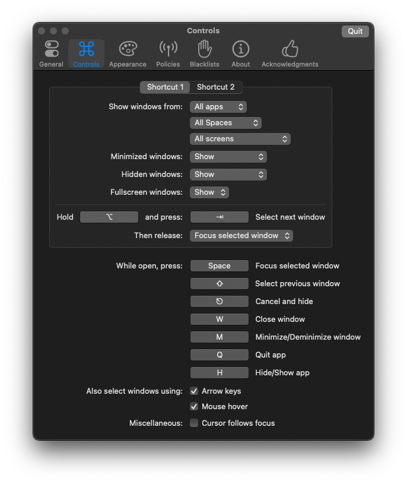
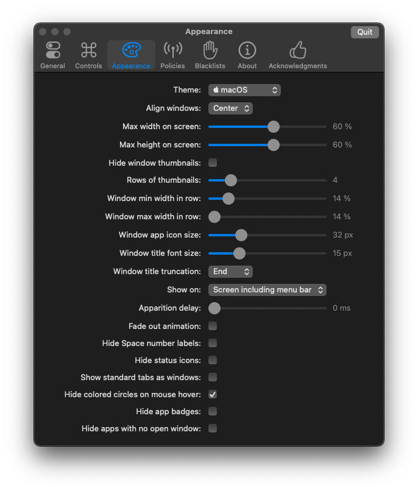
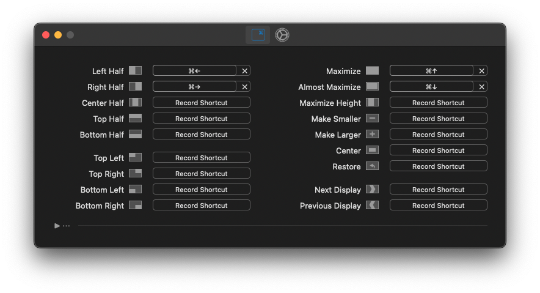

# macOS PC mode

All-in-one project to help you to get PC-like experience (known from Windows or Linux systems) on your macOS. Mostly for developers & other IT guys, but everyone is welcome. 
Tested on macOS Monterey 12.3.

Perfect if:
- you are a software developer relying mostly on IntelliJ IDEA (or other JetBrains IDE),
- you recently switched to macOS after many years of using Windows or Linux (or you still switch between one of those systems and macOS) and want to have muscle memory on your side,
- you prefer the PC way of managing windows using mostly keyboard instead of gestures.

What you can get:
- PC keyboard shortcuts in your system, browser (Chromium based) and IntelliJ IDEA (other keymaps can be added easily)
    - the configuration works with both PC and Mac keyboards at the same time (there is a special device-checking rule)
    - no custom shortcuts - all of them would do exactly the same on Linux/Windows or almost the same (e.g. <kbd>
      Win</kbd>/<kbd>Option</kbd> key opens Spotlight while on Windows would open Start Menu)
- Dock & built-in switcher replacement
- Basic window management

> You can pick whatever configurations you need and try them. All the changes all easily reversible.

## Keyboard shortcuts

What currently works:
- System-wide shortcuts
  - 10+ typical editing shortcuts like <kbd>Ctrl</kbd>+<kbd>C</kbd>, <kbd>Ctrl</kbd>+<kbd>V</kbd> etc.,
  - <kbd>Ctrl</kbd>+<kbd>←</kbd>/<kbd>→</kbd> (jumping between words), <kbd>Home</kbd>/<kbd>End</kbd> (go to line start/end),
  - <kbd>Win</kbd>+<kbd>L</kbd> (lock screen),
  - <kbd>Ctrl</kbd>+<kbd>Alt</kbd>+<kbd>L</kbd> (open iTerm),
  - <kbd>Win</kbd> (open Spotlight - can be easily changed to open Launcher, Alfred or any other app).
- Browser shortcuts (only Chromium based like Chrome, Brave, Vivaldi etc.)
  - <kbd>Ctrl</kbd>+<kbd>T</kbd> (new tab), <kbd>Ctrl</kbd>+<kbd>N</kbd> (new window), <kbd>Ctrl</kbd>+<kbd>H</kbd> (history) and more
  - <kbd>F5</kbd> (refresh page) nad <kbd>Shift</kbd>+<kbd>F5</kbd> (refresh page with cache cleanup)
- IntelliJ shortcuts - according to [official reference card](https://resources.jetbrains.com/storage/products/intellij-idea/docs/IntelliJIDEA_ReferenceCard.pdf)
  - Navigation, Refactoring, Compile and Run, Debugging, Usage Search, VCS / Local history - 100% working
  - Editing - all working except one - *Surround with...*
  - the rest - working in most cases

### Importing karabiner-elements rules

1. Install [Karabiner-Elements](https://karabiner-elements.pqrs.org/)
2. Open Karabiner-Elements, create new profile (e.g. _PC mode_) and select it:


3. Open the following URL in your browser and allow the website to open Karabiner-Elements.app:

     ```
     karabiner://karabiner/assets/complex_modifications/import?url=https://raw.githubusercontent.com/raxigan/macos-pc-mode/main/pc-mode.json
     ```

4. Click _Import_:


5. Click _Enable All_:


> Karabiner-Elements stores rules in `~/.config/karabiner/assets/complex_modifications` directory. To tweak
> the rules update the json files there and re-enable the rules in _Complex modifications_ tab. Rules order is important and it can be changed there also.

> Bear in mind that many of the configured shortcuts may collide with the system ones, so you may need to disable some of them in your system.
> Also remember about selecting the following checkbox in *System Preferences* to use F-keys as standard function keys:
> 
> 

> #### Mac keyboards
> There is a rule called *Opt & Cmd swap* thanks to which the setup works with
> Mac keyboards as well. If it does not work for you or if you want to add additional Mac devices
> update the rule in the [pc-mode.json](https://github.com/raxigan/macos-pc-mode/blob/main/pc-mode.json) file. It requires providing *product_id* and *vendor_id* numbers which
> can be found via Karabiner-EventViewer.app in *Devices* tab.

### Importing IntelliJ IDEA keymap

1. Install IntelliJ plugin [XWin Keymap](https://plugins.jetbrains.com/plugin/13094-xwin-keymap) (it used to be preinstalled).
2. Copy [XWin IntelliJ IDEA.xml](https://github.com/raxigan/macos-pc-mode/blob/main/XWin%20IntelliJ%20IDEA.xml) file into the keymap configuration directory: `~/Library/Application Support/JetBrains/IntelliJIdea2021.3/keymaps` (the path may differ).

> Alternatively you can clone this repository and create symbolic link to the keymap file.

3. Restart IntelliJ IDEA and go to Preferences → Keymap and from the dropdown list select *XWin IntelliJ* keymap.

> Some configured shortcuts cannot be changed in the IDE because of validation. For such cases
> it's required to perform the tweaks directly in the keymap file then restart the IDE.

### Fixing <kbd>Home</kbd> & <kbd>End</kbd> keys

By default, macOS does not bind <kbd>Home</kbd> & <kbd>End</kbd> keys to any function. 
To make them to, respectively, move caret to beginning and end of line run the following command within
this project root directory (clone it first): 
```
mkdir ~/Library/KeyBindings && cp DefaultKeyBinding.dict ~/Library/KeyBindings
```

Then restart your Mac.

## Dock and Switcher replacement

It is not my intention to hate the Dock here, but... Let's get rid of it 😄.

There is no option to hide or remove the Dock completely, so it's required to tweak its auto-hide configuration.

1. In macOS _System Preferences_ → _Dock & Menu Bar_ enable _Automatically hide and show the Dock_.
2. Configure the Dock to show up after 2 second (in case you really need it) by running this command in your terminal:
```
defaults write com.apple.dock autohide-delay -float 2; killall Dock
```

> To restore default Dock settings run the command:
> ```
> defaults delete com.apple.dock autohide-delay; killall Dock
>```

3. Install [AltTab](https://alt-tab-macos.netlify.app/). Example configuration:




> To keep the AltTab list clean and short it's recommended to use
> the Blacklists feature to exclude less frequently used apps from it and/or
> the ones that can be easily accessed in some other way (e.g. Spotify, Docker Desktop etc.)

## Window management

Install [Rectangle](https://rectangleapp.com/), then if you want to have basic window snapping functionality (like in Windows via <kbd>Win</kbd>), you may set it up the following way:



> Before configuring Rectangle shortcuts select _Default_ profile in Karabiner-Elements (or just quit the app), then set up the shortcuts
> and back to your custom profile again (or start the app).

## Credits
- [@rux616](https://github.com/rux616) for [karabiner-windows-mode](https://github.com/rux616/karabiner-windows-mode)
- [@tezeko](https://github.com/tekezo) for [Karabiner-Elements](https://github.com/pqrs-org/Karabiner-Elements)
- [@serhii-londar](https://github.com/serhii-londar) for [open-source-mac-os-apps](https://github.com/serhii-londar/open-source-mac-os-apps)
- [@Damien](https://www.maketecheasier.com/author/damienoh/) for [Home & End keys fix](https://www.maketecheasier.com/fix-home-end-button-for-external-keyboard-mac/)
- [@Christian Long](https://apple.stackexchange.com/users/41838/christian-long) for [Dock auto-hide config](https://apple.stackexchange.com/a/82084)

## Contributing

Clone the project and create symlinks pointing to files you want to use & edit in appropriate directories:
- Karabiner-Elements complex modifications directory: `~/.config/karabiner/assets/complex_modifications`
- JetBrains IDE keymap directory: `~/Library/Application Support/JetBrains/{VERSION}/keymaps`

For example:
```
cd ~/dev
git clone https://github.com/raxigan/macos-pc-mode
cd ~/.config/karabiner/assets/complex_modifications
ln -sfn ~/dev/macos-pc-mode/pc-mode.json pc-mode.json
```
